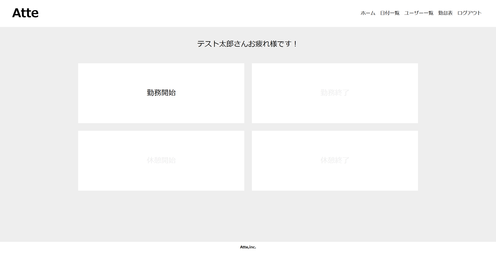
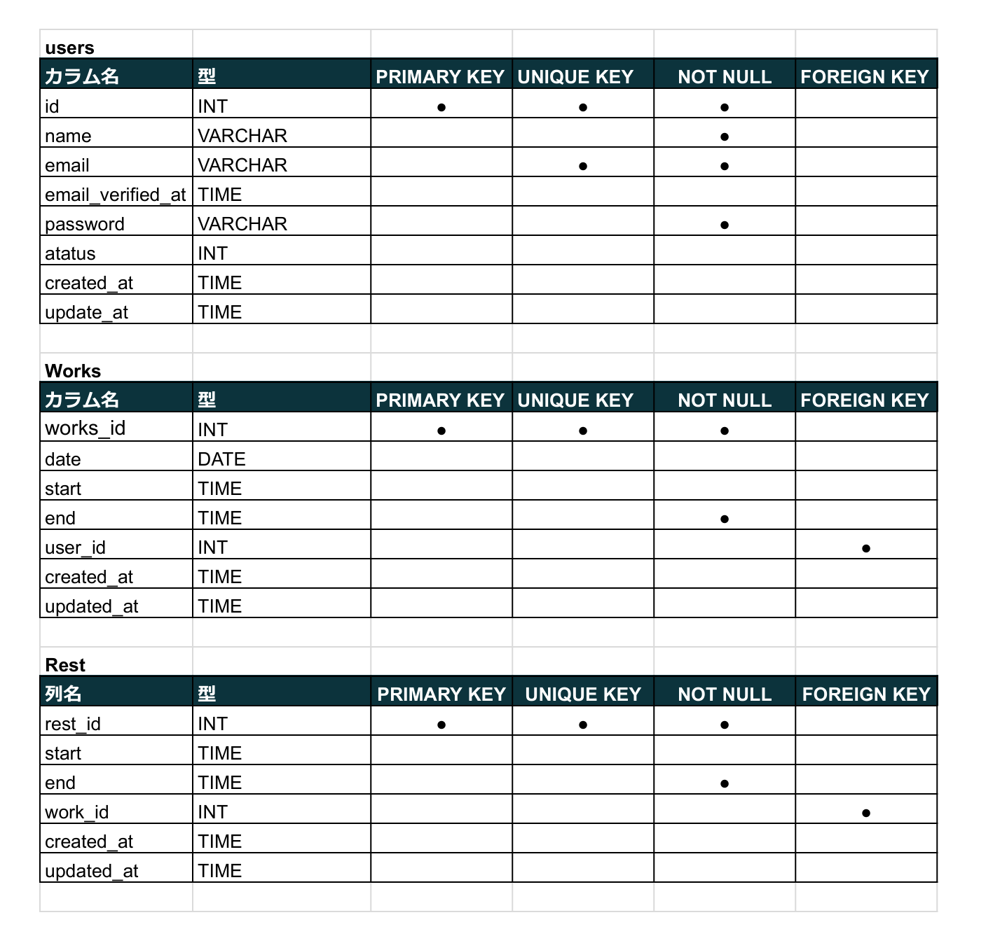

# Atte（アット）

## 概要説明
- Atteは、社員の勤怠管理を行うためのシステムです。社員の出退勤や休憩時間を管理し、人事評価にも役立てられるよう設計されています。

## 作成した目的
- 社員の勤怠データを正確に収集、人事評価のため作成しました。

## アプリケーションURL
- ログイン情報: テストアカウントでログイン可能
- メールアドレス: admin@example.com
- パスワード: admin123

## 他のリポジトリ
関連するリポジトリがあれば記載してください。例）バックエンドとフロントエンドが別の場合：
- [バックエンドリポジトリ](https://github.com/example/backend)
- [フロントエンドリポジトリ](https://github.com/example/frontend)

## 機能一覧
- 社員のログイン・ログアウト機能
- 勤務開始・終了、休憩開始・終了の記録機能
- 勤怠データの日別、ユーザー別の確認
- 確認メールを通じたアカウント認証機能

## 使用技術
- バックエンド:Laravel 8.x
- フロントエンド: HTML, CSS
- データベース: MySQL
- その他: Docker（開発環境用）

## テーブル設計

## ER図

## 環境構築
他の人がプロジェクトを実行するための手順を示します。

## アカウントの種類
- 管理者アカウント
- メール: admin@example.com
- パスワード: admin123
- 一般社員アカウント
- メール: employee@example.com
- パスワード: employee123# atte
